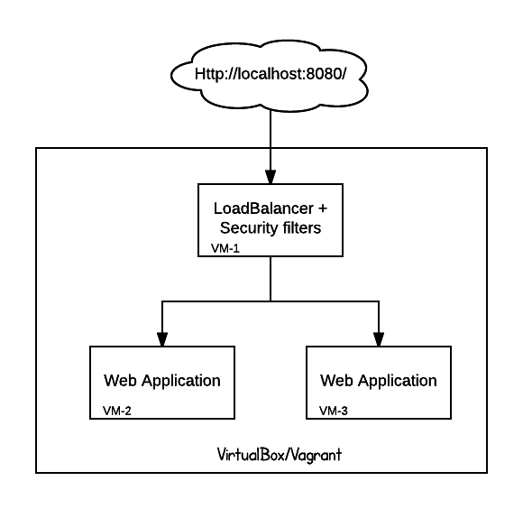

# The devops way of greeting the world. Hello World!!!

What is the first thing we do when we start learning?
Yes, you are right, we learn how to greet the world.

The following project is all about greeting the world. The setup is easy and its for those who wants to learn each and every aspect of application programming right from planning to requirement gathering to coding, testing and finally the deployment phase.

## Getting Started

These instructions will help those who are new to the devops world and wants to learn about various phases involved in the lifecycle or an application. The project uses all the open source tools, so there is no cost involved in setting up your first infrastructure and greet the world whilst entering into this new field of devops.

If you have followed each and every instruction in this README in the same order you will get a setup that will look similar to below diagram:



## Prerequisites

You will require the following tools/products in your laptop/desktop (wherever you want to start your journey) to proceed with the project:

- [Vagrant](https://www.vagrantup.com/downloads.html) version used: Vagrant 1.8.7
- [VirtualBox](https://www.virtualbox.org/wiki/Downloads) Version used: 5.1.26 r117224
- [ruby](https://www.ruby-lang.org/en/) version used: ruby 2.4.0

Do not worry if you know nothing about these pre-requisites. You can follow
[Getting Started with Vagrant](https://www.vagrantup.com/intro/getting-started/) and [VirtualBox](https://www.virtualbox.org/wiki/Technical_documentation) to learn more about them.

## Planing setup and tools used

In order to make it simple we will follow a particular directory structure. You can follow your own structure but this is what I have followed as it helps me in remembering the usage of each and every file in the project.

```
hello-world/
├── puppet
│   ├── hiera
│   │   └── nodetype
│   ├── manifests
│   └── modules
│       ├── loadbalancer
│       │   ├── files
│       │   ├── manifests
│       │   ├── spec
│       │   │   └── classes
│       │   ├── templates
│       │   └── tests
│       ├── sudoers
│       │   ├── files
│       │   ├── manifests
│       │   ├── spec
│       │   │   └── classes
│       │   └── tests
│       └── webapp
│           ├── files
│           ├── manifests
│           ├── spec
│           │   └── classes
│           ├── templates
│           └── tests
└── spec
    └── loadbalancer
```

### Operating System
Ubuntu: I have never played with debian based systems. So this is my first interaction with it. I did some research in forums and blogs about which operating system is better and popular. I always thought it to be RHEL, but to my surprise it is not and Ubuntu is by far the most used linux based operating systems and constitutes on an average about 40-50% and RHEL/CentOS being only 10-20%. Here are some facts:

 - [w3techs](https://w3techs.com/technologies/details/os-linux/all/all)
 - [openstack](https://www.openstack.org/assets/survey/April-2016-User-Survey-Report.pdf)
 - [CentOS Ubuntu Comparison](https://thishosting.rocks/centos-vs-ubuntu-server/)

I still like RHEL due to its stability and security.

### Puppet and Hiera
As of today I have written code in Puppet and Ansible which are 2 major configuration managements tools used today. The choice of tools depends on personal preference and the way these tools interact with your environment.

Puppet runs in 2 different mode: Agent or Masterless (apply). Puppet works with an install on every machine that it manages, and the only difference is whether the catalog is fetched on every run from a server, or copied to every machine first. Puppet uses ruby.

Ansible on the other hand is run from one location and connects to the machine it manages over ssh. This means that there is no need to install any software/tool/agent on servers. Although ansible needs python.

My personal preference is Ansible but the fact that puppet ensures the server's configuration over a period of time in case of drift, in agent mode is cool. Also puppet has a large community presence and is quite a mature solution. Ansible on the other hand is still growing. I am quite familiar with puppet as I have been writing puppet code for past 2-3 years and I am very new in Ansible.

For this project puppet constitutes of 3 sub-directories and a files
 - modules directory
 - manifests directory
 - hiera directory
 - hiera.yaml

modules: All the server configurations are provided in the form of puppet modules to keep it modular. It comprises of following modules created:
 - loadbalancer: Nginx is used for loadbalancing.
 - sudoers: sudoers related configuration.
 - webapp: Application related configuration which is a php hello world application.

manifests: A default manifest is created which comprise of default node and includes all the classes defined via hiera include functionality.

```
node default {
  hiera_include(classes)
}
```

hiera: Hiera provides the data to puppet for configuring servers as per the nodetype defined for the server in vagrantfile. The hiera.yaml file comprise of the following hierarchical structure

```
:hierarchy:
  - 'nodetype/%{::nodetype}'
  - global
```

With the use of such system when the server boots up it uses the custom nodetype fact and executes the classes specified in the yaml structure. According to our hiera hierarchy all the classes (puppet) mentioned in the global.yaml file will be applied to each and every server. Rest of the structure will be applied as per the nodetype e.g.

The below syntax in the loadbalancer.yaml applies the puppet class from the module loadbalancer and configures the node.

```
---
classes:
  - loadbalancer

```

### Serverspec
Serverspec tests your servers’ actual state by executing command locally, via SSH, via WinRM, via Docker API and so on. So you don’t need to install any agent softwares on your servers and can use any configuration management tools, Puppet, Ansible, CFEngine etc.

### Naxsi
Naxsi is one of the popular WAF (Web Application Firewall) for Nginx. Another one is ModSecurity but that requires to be build from source for nginx and hence to keep things simple I chose Naxsi. the configuration provided is default.

### Execution
The below steps will lead you to the working vagrant environment:

1. Clone the project from github into a new directory and make sure all the submodules are also extracted

```
>> git clone https://github.com/naikajah/hello-world.git
>> git submodules update --init
```

2. For the sake of simplicity nodes.yaml file is provided that comprise of all the nodes that will get created. You can either create all the machines together by

```
>> vagrant up
```

or create them one by one as below.

```
>> vagrant up webapp-1
```

```
>> vagrant up webapp-2
```

```
>> vagrant up loadbalancer
```

Once the vagrant machines are created it is configured to run few automated tests to identify any issues immediately after the machine is up. These tests are performed only on the machine having a nodetype of loadbalancer.

```
==> development: **********  NGINX port test  **********
==> development: Loadbalancer is listening on port 80
==> development: **********  Webapp test  **********
==> development: Web application failure detected Status code 502
==> development: **********  App server 1 connectivity test  **********
==> development: App server 1 failed to respond on port 9000
==> development: **********  App server 2 connectivity test  **********
==> development: App server 2 failed to respond on port 9000
```

## Verifying the setup - automated

Serverspec tests are provided to test the vagrant machines readiness and to know about the failures. These are created with following structure. You need to have ruby, rubygems and bundler installed.

```
apt-get install ruby rubygems bundler
```

Gemfile is provided for dependencies. So execute the below command from within hello-world folder.

```
bundle  install --path ./gems/
```

In order to run the serverspec tests run the below command within the hello-world folder

```
bundle exec rake spec
```

** NOTICE: serverspec tests should be executed once the vagrant machines are up and running. Since the test gets executed within the loadbalancer node. Thus it uses the url http://localhost:80 (nginx port).

## Verifying the setup - manual

We can verify the application via browser. Open the browser and browse to
http://localhost:8080/ (8080 is the local port in the host machine which is mapped to port 80 in the guest machine)

This should serve similar page as below: Notice the hostname of the server which is serving the page.

```
Hello World!! from weapp-1
```

WELL DONE!!!!!

## Authors

* **Piyush Kumar** - [Github](https://github.com/naikajah)
